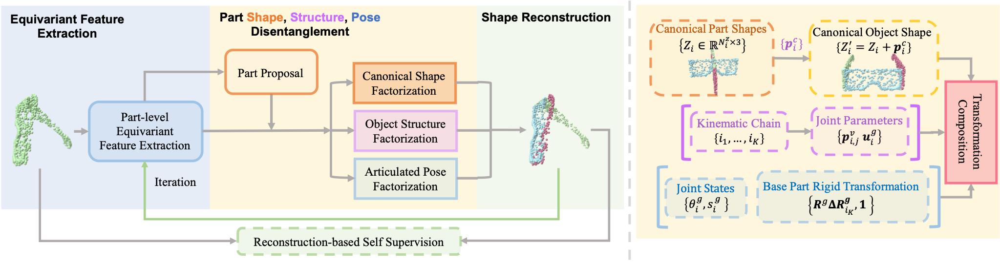

# Equi-Articulated-Pose

Code repository for our paper [Self-Supervised Category-Level Articulated Object Pose Estimation with Part-Level SE(3) Equivariance](https://equi-articulated-pose.github.io/). 



## Links

- [Project Page](https://equi-articulated-pose.github.io/)
- [arXiv Page](https://arxiv.org/abs/2302.14268)
- [Openreview Page](https://openreview.net/forum?id=20GtJ6hIaPA)


## Environment and package dependency

Create a virtual environment: 
```shell
conda env create -f env.yaml
```

Install the vgtk package:
```shell
cd vgtk && python setup.py install && cd ..
```

## Data

Please download data from [this link](https://drive.google.com/drive/folders/1SG1aPtJLlVp-rV34YqY_Az_Bru5XxKsc?usp=sharing) and put them under the folder `./data`. 

## Training

```shell
bash scripts/train/${CATEGORY_NAME}.sh
```

## Evaluation

```shell
bash scripts/val/${CATEGORY_NAME}.sh
```

## Checkpoints

Please download trained models from [this link](https://drive.google.com/drive/folders/1tSg7-JjWCavrRiawdOyIVC4Tew-FnESc?usp=sharing) and put them under the folder `./ckpt`. 


## Contact

Feel free to contact me at xymeow7@gmail.com or create a Github issue if you have any question regarding the repository. Thanks for your interest.


## Citation

If you find the code useful for your research, please cite our paper.

```
@inproceedings{liu2023self,
  title={Self-Supervised Category-Level Articulated Object Pose Estimation with Part-Level SE (3) Equivariance},
  author={Liu, Xueyi and Zhang, Ji and Hu, Ruizhen and Huang, Haibin and Wang, He and Yi, Li},
  booktitle={The Eleventh International Conference on Learning Representations},
  year={2023}
}
```


## License

The majority of the code is licensed under an Apache License 2.0 (see LICENSE file for details).


## Reference

Part of the code is taken from [EPN](https://github.com/nintendops/EPN_PointCloud), [equi-pose](https://github.com/dragonlong/equi-pose). Thank you to the authors of these projects for their great work.
